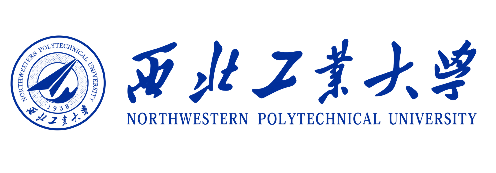
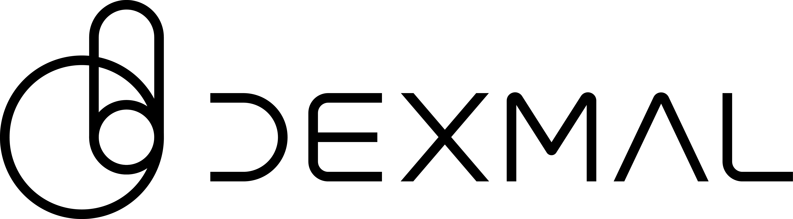
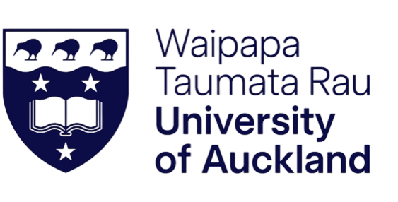
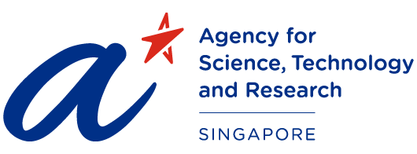

## 👋 Hi there, I'm Zhuoyuan!
I am currently a Research Assistant at the [MARS Lab](https://marslab.tech/) at Nanyang Technological University (NTU), where I work under the guidance of Prof. [Jianfei Yang](https://marsyang.site/), with a research focus on Embodied AI. Prior to this, I earned my Master’s degree in Robotics from the National University of Singapore, where I conducted research under the supervision of Prof. [Chee Meng Chew](https://sites.google.com/site/cmchewhome/home) and Prof. [Hongliang Guo](https://scholar.google.com.sg/citations?user=vR9kUw8AAAAJ&hl=en). I received my Bachelor of Engineering degree from Northwestern Polytechnical University.

## 🦾 Research Interests

- Real to Sim to Real
- Robot Learning
- World Model & Vision Language Action Models

## 📢 News

- [Sep. 2026]🚀 Excited to share that I’m starting a new position as Research Assistant at MARS Lab!
- [Nov. 2025]🚀 I've taken up a research internship at Dexmal.
- [Oct. 2025]✈️ I am attending IROS 2026 (Hangzhou, China). Let's have a chat!
- [May. 2025]🎯 I've completed my Master's Degree at NUS!
- [Apr. 2025]🎉 Our paper <a href="https://ieeexplore.ieee.org/document/10948339">Multi-Robot Reliable Navigation in Uncertain Topological Environments With Graph Attention Networks</a> has been accepted to IEEE RA-L!
- [May. 2024]💼 I have joined A*STAR as a student intern.
- [Aug. 2023]🚀 I've started my Master of Engineering at NUS!



## 🎓 Education

  

    

    

      
National University of Singapore (NUS)

      
College of Design and Engineering

      
MEng. in Mechanical Engineering

    

    
<strong>Aug. 2023 - May 2025</strong>Singapore

  

  

    

    

      
Northwestern Polytechnical University (NWPU)

      
School of Aeronautics

      
BEng. in Aircraft Design and Engineering

    

    
<strong>Sep. 2019 - Jul. 2023</strong>Xi'an, China

  

## 🔬 Research Experience

  

    

    

      
MARS Lab, Nanyang Technological University

      
Research Assistant - Embodied AI

    

    
<strong>Sep. 2026 - Present</strong>Singapore

  

  

    

    

      
Dexmal

      
Research Intern - Real to Sim to Real, Reinfocement Learning

    

    
<strong>Nov. 2025 - Aug. 2026</strong>Beijing, China

  

  

    

    

      
University of Auckland

      
Research Student - Hierarchical Robot Learning

    

    
<strong>Aug. 2025 - Oct. 2025</strong>Auckland, New Zealand

  

  

    

    

      
Agency for Science, Technology and Research

      
Research Intern - Multi-agent Path Finding

    

    
<strong>May 2024 - Jan. 2025</strong>Singapore

  

